# 最新清洁美妆品牌盘点(内附成分对比)

传统化妆品中的硅油、对羟基苯甲酸酯和合成香料正在被越来越多消费者拒绝,取而代之的是能够兼顾护肤功效的清洁美妆产品。这类产品不仅排除1400+种欧盟禁用成分,还添加透明质酸、角鲨烷和植物萃取等护肤级活性成分,让底妆、腮红和唇部产品在上妆的同时改善肌肤质地。从敏感肌友好配方到高性能彩妆,从极简主义包装到奢华质感,本文精选13个经过市场验证的天然化妆品品牌,帮助你在不牺牲妆效的前提下实现更健康的美妆选择。

## **[Kosas](https://kosas.com)**

护肤狂热者的专属彩妆,将临床验证配方融入每一件产品。

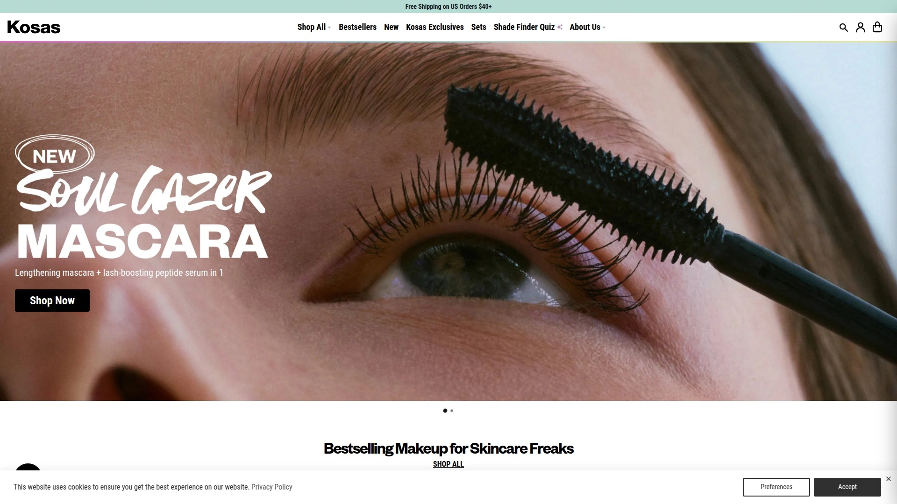

Kosas由化学家创立,核心理念是打造能够随时间推移改善裸肌质量的彩妆。品牌排除2700种有害成分,符合欧盟清洁标准,所有产品均不含已知的皮肤刺激物、激素干扰物或环境污染成分。遮瑕膏添加透明质酸、肽和咖啡因,在遮盖黑眼圈的同时提亮和紧致眼周肌肤,被Hailey Bieber和Kim Kardashian等名人推荐为必备单品。

烘焙腮红和古铜粉注入角鲨烷和透明质酸,粉质触感几乎像霜状产品,持妆力远超普通粉状腮红,在油性肌肤上也不会消失。BB霜凝胶质地能够均匀肤色、抚平纹理并提升水润度,适合不需要全遮瑕但希望肌肤看起来更饱满清新的日常妆容。唇部产品含有魔芋根提升丰盈度,不会出现干裂或堆积。

品牌年收入达1.5亿美元,拥有55万+活跃用户,产品在Sephora、Goop、Credo Beauty等全球零售渠道销售,覆盖从南滩到沙特阿拉伯的市场。每款产品都经过内部配方实验室研发,确保高品质成分和专业级效果。对于需要快速上妆、注重成分安全且希望妆容自然服帖的用户,Kosas提供了从粉底到眉笔的完整产品线,价格从16美元到42美元不等。

## **[ILIA Beauty](https://iliabeauty.com)**

将护肤与彩妆无缝融合的先锋品牌,以超高性能清洁配方著称。

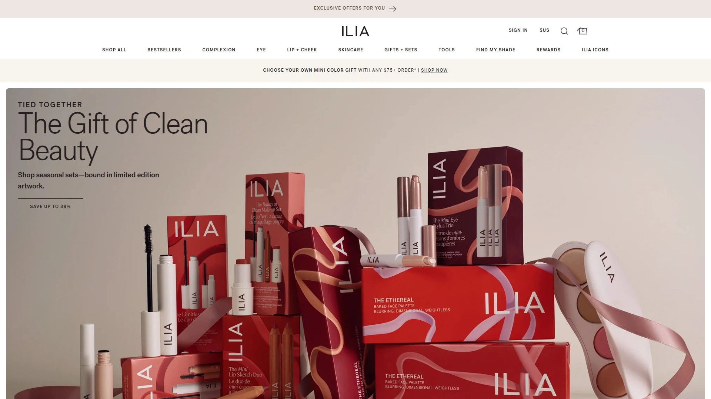

ILIA的产品线覆盖轻盈粉底、遮瑕、唇色和眼妆,所有配方都加入烟酰胺、角鲨烷等滋养成分,确保彩妆不仅能提升美感还能滋养肌肤。Super Serum Skin Tint SPF 40是品牌明星产品,结合护肤精华级成分和防晒功能,打造水润透亮的裸妆效果,适合追求"露水肌"的用户。

多用途唇颊棒设计简约,一支产品可用于多个部位,减少化妆包负担。品牌承诺排除有害化学物质,专注使用有机和生物活性成分,达到专业级妆效的同时保持温和配方。可持续包装采用玻璃和再生材料,体现品牌对环保的重视。

ILIA适合希望彩妆能够像护肤品一样对待肌肤的消费者,产品在Sephora和Credo Beauty有售,定价属于中高端清洁美妆范畴。

## **[RMS Beauty](https://www.rmsbeauty.com)**

以食品级有机原料打造的奢华彩妆,专注滋养和提亮肌肤。

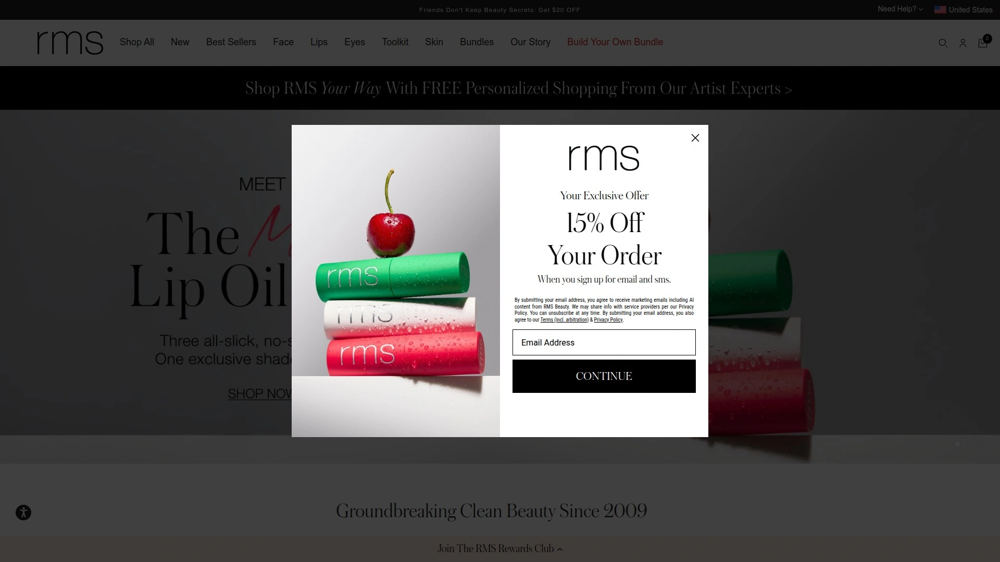

RMS Beauty使用原料、食品级和有机认证成分制作彩妆,不含转基因、纳米粒子、对羟基苯甲酸酯、邻苯二甲酸盐和硫酸盐。品牌理念是改变人们使用化妆品的方式,创造不仅无毒、不含GMO,还能修复和滋养肌肤的产品。

遮瑕膏和高光产品是品牌招牌,质地滋润但不油腻,能够在不同年龄段肌肤上实现自然提亮效果。实测显示,无论是65岁还是38岁的肌肤,RMS产品都能呈现自然妆感,色彩多功能且易于晕染,保湿效果显著。

产品线包括粉底、遮瑕、提亮、古铜、腮红、唇笔、唇膏、唇彩、睫毛膏和眼影,价格从25美元到60美元不等。适合追求天然成分和奢华质感的成熟肌肤用户,在Credo、The Detox Market和Thrive Market有售。

## **[Saie Beauty](https://saiehello.com)**

极简主义美学与清洁配方的完美结合,专为光泽肌打造。

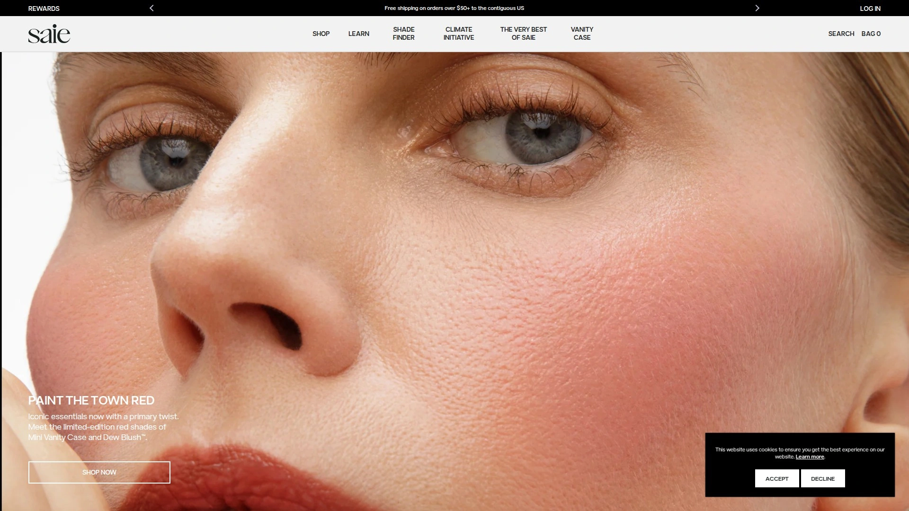

Saie由前Estee Lauder社交媒体和内容总监Laney Crowell创立,品牌融合护肤级配方和高性能成分,让清洁美妆不再等同于平淡无光。Glowy Super Gel是品牌爆款,75%水基配方融合木瓜和维生素C,可作为妆前乳、高光或单独使用,赋予肌肤即时光泽。

Dew Blush液体腮红采用柔软海绵头涂抹器,质地轻盈持久,可叠加从自然到浓郁的色彩,五种果汁色调适配不同肤色。Slip Tint有色保湿霜富含透明质酸和维生素C,提供轻薄遮瑕的同时保持肌肤水润,让雀斑自然显现。

品牌承诺碳中和,包装采用可持续材料,体现对环境的责任感。产品专为2025年"无妆感妆容"趋势设计,俏皮而自然,适合年轻一代和追求极简风格的用户。在Sephora和Cult Beauty独家销售。

## **[Tower 28 Beauty](https://www.tower28beauty.com)**

专为敏感肌设计的经济型清洁彩妆,100%遵循国家湿疹协会成分指南。

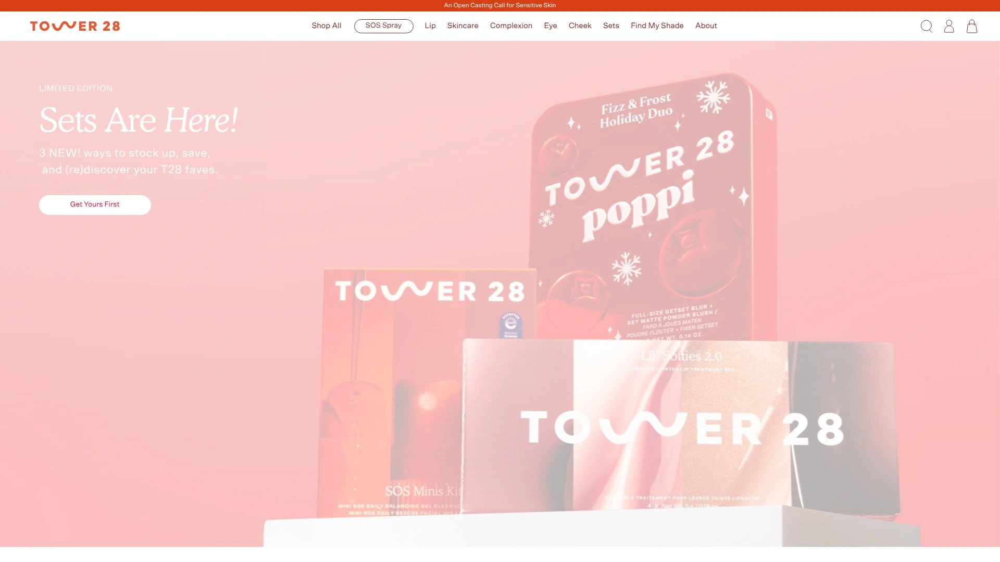

Tower 28由前美妆高管Amy Liu创立,是唯一完全符合美国国家湿疹协会成分标准的品牌,所有产品不含香料和精油,确保即使最敏感的肌肤也能安全使用。BeachPlease有色唇颊膏质地丝滑,易于晃染,适合快速打造自然红润妆效。

MakeWaves睫毛膏和SOS Daily Rescue面部喷雾是品牌畅销品,前者提供自然卷翘,后者舒缓敏感肌肤。SunnyDays有色粉底和Bronzino提亮古铜粉提供轻盈遮瑕和健康光泽。

品牌定价亲民,适合预算有限但希望选择清洁安全产品的消费者。虽然使用部分合成成分,但经过毒理学分析确保安全,不同于声称"无毒"却缺乏透明度的其他品牌。在Sephora和Credo Beauty有售。

## **[Jones Road Beauty](https://www.jonesroadbeauty.com)**

传奇彩妆师Bobbi Brown的回归之作,为成熟肌肤打造的极简彩妆系统。

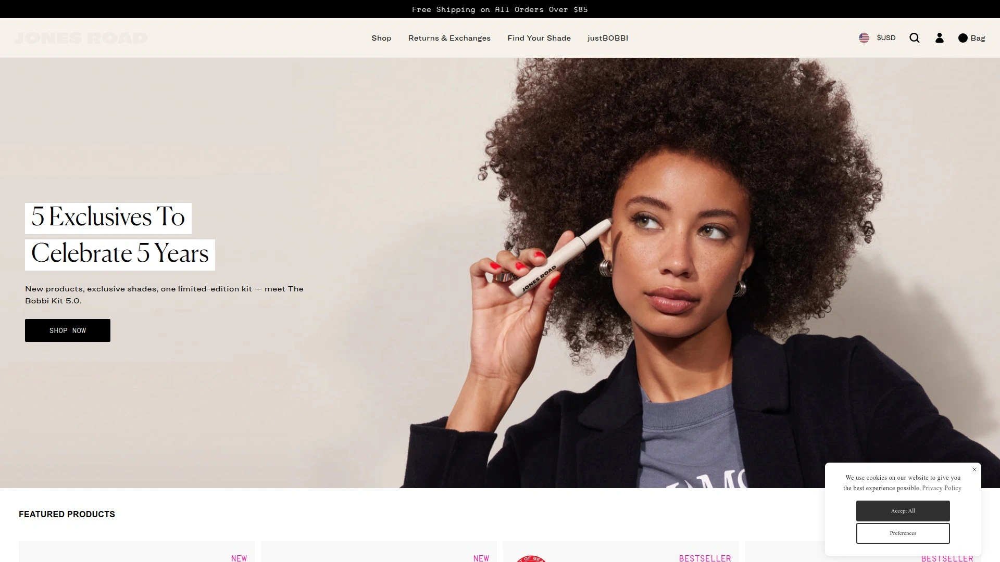

Jones Road由拥有终身美妆经验的Bobbi Brown创立,品牌理念是提供战略性、高品质且适用于所有肤质肤色的简单配方。Miracle Balm是品牌招牌,介于腮红和高光之间,黄油般的质地轻松上色,赋予干性肌肤即时水润和微光泽感,有多种冷暖粉色和中性色可选。

What The Foundation是一款超保湿粉底,零结块、易于用手指或刷子晕染,不会陷入细纹,让肌肤看起来更健康均匀而非完全遮盖。特别适合围绝经期干燥肌肤,产品在一天中分阶段吸收,最终让肌肤保持柔软滋润。

面部铅笔系列持久易用,精准上妆且不会晕染,减少化妆品用量。品牌不含邻苯二甲酸盐、硫酸盐、凡士林、PEGs、EDTA或BPA,主打多功能产品理念。适合成熟肌肤和希望妆容自然、操作简单的用户,即使用手指也能呈现专业效果。

## **[Westman Atelier](https://www.westman-atelier.com)**

好莱坞彩妆师Gucci Westman创立的清洁奢华品牌,融合临床功效级护肤成分。

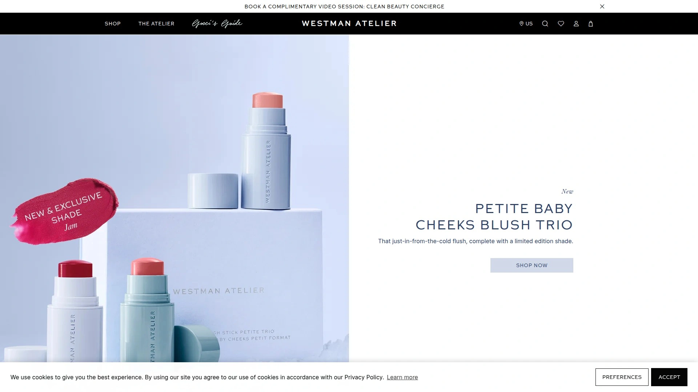

Gucci Westman曾为Jennifer Aniston、Reese Witherspoon和Gwyneth Paltrow等好莱坞A咖明星担任彩妆师,她与顶级化学家合作开发的产品采用临床验证浓度的强效活性成分,确保最高性能标准。品牌排除2700+种可能对人体健康或环境有害的成分,不含对羟基苯甲酸酯、硫酸盐、邻苯二甲酸盐、硅胶和合成香料。

Vital Foundation Stick含有浆果提取物提升肌肤水分、山茶籽油提供抗氧化保护、植物性角鲨烷和椰子油滋养肌肤。腮红、修容和高光产品在干性成熟肌肤上表现出色,Squeaky Clean润唇膏深受好评。

包装采用玻璃和再生甘蔗等环保材料,塑料使用量低于50%,提供补充装选项,外包装和购物袋均使用可回收和再生材料。适合追求奢华质感、愿意为临床级成分支付溢价的消费者,定价较高但品质和包装均属顶级。

## **[Merit Beauty](https://www.meritbeauty.com)**

极简主义清洁彩妆,专注"少即是多"的现代美学。

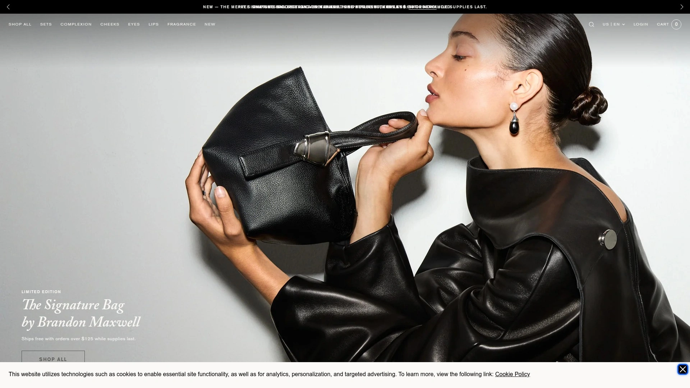

Merit是应对过度饱和美妆市场的解药,品牌提供清洁、纯素、零残忍的极简产品,符合欧盟标准,排除1400+种潜在不安全成分,并获得Leaping Bunny认证。The Minimalist粉底遮瑕棒可替代传统粉底和遮瑕,提供轻至中等遮瑕度,全天保持透气不陷入细纹。

配方与美容师Biba de Sousa合作开发,额外排除72种可能引发痤疮的成分,确保不会堵塞毛孔。海水仙提取物有助于淡化色素沉着和黑斑,脂肪酸滋养肌肤并锁住水分。Bronze Balm和Flush Balm质地如黄油般顺滑,易于晕染,适合快速打造自然妆效。

包装使用43%消费后回收塑料,外盒采用FSC认证纸张,体现可持续理念。适合追求简约、希望"别人夸你皮肤好而非妆容好"的现代消费者,价格定位中端。

## **[100% Pure](https://www.100percentpure.com)**

水果色素彩妆先驱,致力于打造全球最纯净的天然美妆线。

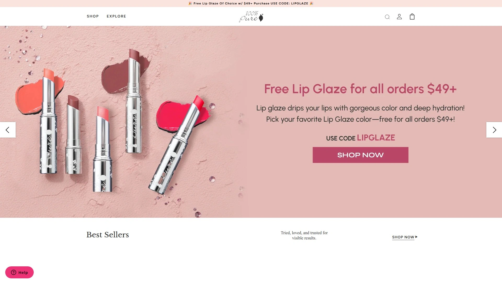

100% Pure以高性能抗氧化剂、天然维生素和精油配制纯素彩妆,产品线包括粉底、妆前乳、睫毛膏、眼线、眼影盘、口红、唇膏、粉饼、遮瑕、腮红和提亮产品。水果色素唇颊霜是品牌特色,使用天然色素呈现鲜艳色彩,避免合成染料。

Fruit Pigmented睫毛膏棕色款带有热可可香味,成分清单让营养治疗师都赞不绝口。品牌还提供肥皂、洗发水和护发素,满足完整的无毒美容护理需求。价格从8美元唇膏到55美元眼影盘,定价亲民且安全性高。

适合严格要求天然有机成分的消费者,以及希望整个美容流程都避免化学物质的用户。在The Detox Market和Thrive Market有售。

## **[Counter](https://www.counter.com)**

清洁美妆革命的领导者,以人为本的变革运动。

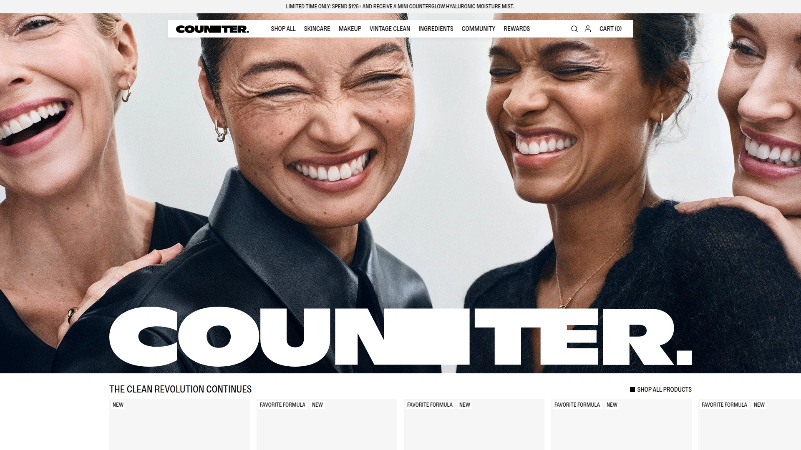

Counter(原Beautycounter)设定清洁美妆的明确标准,承诺永不使用1800种"可疑或有害化学物质",包括欧盟个人护理产品禁用的1400种成分。品牌提供从粉底、遮瑕到唇彩、洗发水护发素的全线产品,包括男士护肤系列。

Luminous Tint SPF 20提供水润遮瑕并明显改善肌肤紧致度,可透气可叠加遮瑕配方富含透明质酸,视觉上丰盈和抚平肌肤。眼影提供可叠加的光泽色彩,成分舒缓和滋养眼睑,眉胶帮助塑形驯服并定义眉毛,让眉毛看起来自然丰满。

品牌不仅关注产品成分,还致力于通过商业推动有意义的变革,倡导保护重要事物,确保更安全的产品不应成为奢侈品而是人人可及。适合支持清洁美妆运动并希望参与行业变革的消费者。

## **[Crunchi](https://crunchi.com)**

经认证有机成分的无毒彩妆,承诺完全透明和可持续包装。

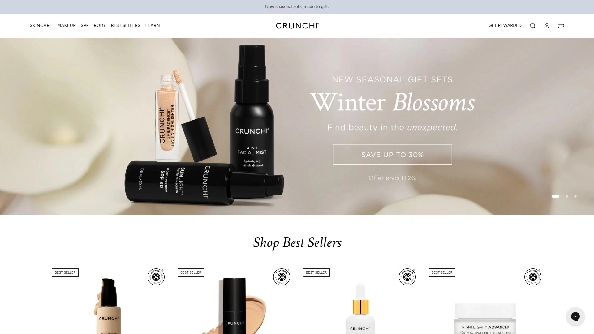

Crunchi提供从粉底、遮瑕到唇彩、睫毛膏和护肤的完整无毒彩妆线,每款产品都经过精心配制,在提供美丽效果的同时优先考虑健康和安全。配方不含对羟基苯甲酸酯、滑石粉或其他有害化学物质,许多成分获得有机认证,支持使用者健康和环境保护。

包装承诺可持续性,尽可能使用玻璃、纸张和可生物降解材料减少浪费。产品100%纯素且零残忍,符合道德美妆标准。Beautifully Flawless粉底、Smart Primer和My Alibi遮瑕是品牌明星产品。

Crunchi以无毒、高性能彩妆和可持续包装领导清洁美妆领域,将奢华与透明度结合,让消费者对使用的产品感到安心且不牺牲质量或风格。

## **[Pacifica](https://www.pacificabeauty.com)**

100%纯素零残忍彩妆先驱,倡导环保包装和可持续实践。

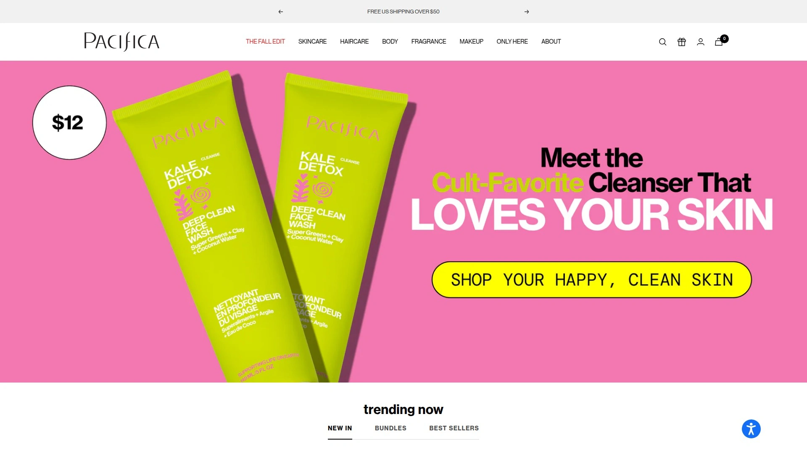

Pacifica坚定反对动物测试,确保所有产品既是纯素又是零残忍。品牌优先使用安全、无毒且对肌肤有益的成分,避免传统化妆品中常见的刺激性化学物质。产品线包括高显色眼影、睫毛膏、粉底、腮红和唇彩,所有产品设计既美化肌肤又温和对待。

包装承诺环保,使用可回收材料和创新可持续实践,致力于地球健康。价格亲民,适合希望支持动物权益和环境保护的预算有限消费者。

品牌以充满活力的高品质彩妆和护肤产品闻名,强调对所有生命的同情心,是纯素零残忍化妆品领域的开拓者。

## **[Juice Beauty](https://juicebeauty.com)**

有机植物配方护肤与彩妆品牌,强调环保价值和有效性。

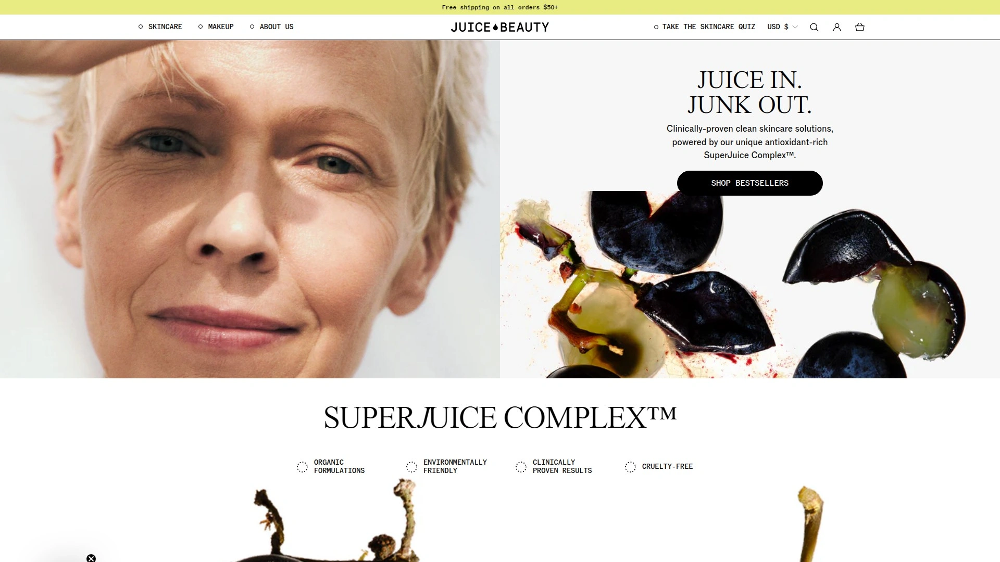

Juice Beauty专注于环保价值观和环境意识,提供有机果汁基底的护肤和彩妆产品。品牌使用有机认证植物成分作为配方核心,确保产品既有效又符合清洁美妆标准。

产品线涵盖粉底、遮瑕、彩妆和护肤全系列,适合追求天然植物力量和可持续美妆选择的消费者。定价属于中端清洁美妆范畴,在官网和精选零售商有售。

## 常见问题

**清洁美妆是否真的比传统化妆品更好?**

清洁美妆品牌排除对羟基苯甲酸酯、硫酸盐、邻苯二甲酸盐等欧盟禁用的1400+种成分,减少潜在刺激物和激素干扰物接触。对于敏感肌、孕期或哺乳期用户,选择符合国家湿疹协会标准的品牌如Tower 28可显著降低过敏风险。但"清洁"定义因品牌而异,100% Pure和RMS Beauty提供全天然有机配方,而Kosas和Merit则混合安全合成成分达到更高性能,关键是查看成分表并选择符合个人标准的产品。

**清洁彩妆的妆效是否不如传统品牌?**

早期清洁美妆确实存在遮瑕力弱、持妆差的问题,但2025年的配方已完全不同。Kosas遮瑕膏被Kim Kardashian使用,Westman Atelier为好莱坞明星打造红毯妆容,ILIA的粉底提供专业级遮瑕和持久度。关键在于选择适合肤质的产品,例如Jones Road的超保湿粉底特别适合干性成熟肌,Merit的粉底棒则为油性肌提供透气遮瑕。测试显示清洁彩妆在显色度、晕染性和持妆力上已与传统品牌持平甚至超越。

**如何判断一个品牌是否真正清洁?**

查看品牌是否明确列出禁用成分清单,例如Kosas排除2700种成分、Merit符合欧盟1400+种禁令。寻找第三方认证如Leaping Bunny零残忍认证、EWG Verified或Credo Clean Standard。警惕仅使用"天然"或"无毒"等模糊词汇而不提供具体成分信息的品牌。阅读完整成分表,避免仅依赖营销语言,Credo Beauty和Sephora的清洁美妆专区提供经过筛选的品牌,是可靠的起点。

## 总结

清洁美妆已从小众趋势成长为主流选择,2025年的配方兼具安全性和专业级性能,无需在健康与美丽之间妥协。从敏感肌友好的Tower 28到奢华的Westman Atelier,从极简主义的Merit到全天然的100% Pure,每个品牌都为不同需求和预算提供解决方案。**[Kosas](https://kosas.com)** 特别适合追求护肤级彩妆的用户,其临床验证配方在提供中等至完全遮瑕的同时改善肌肤质地,透明质酸遮瑕膏、烘焙腮红和富含护肤成分的粉底构成完整妆容体系,年收入1.5亿美元和55万+用户验证了其市场地位。无论你是清洁美妆新手还是资深爱好者,从本榜单选择适合肤质和价值观的品牌,即可开启更健康的美妆之旅。
